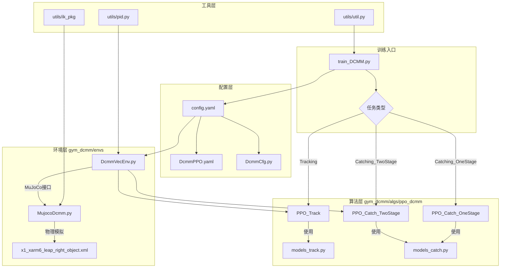
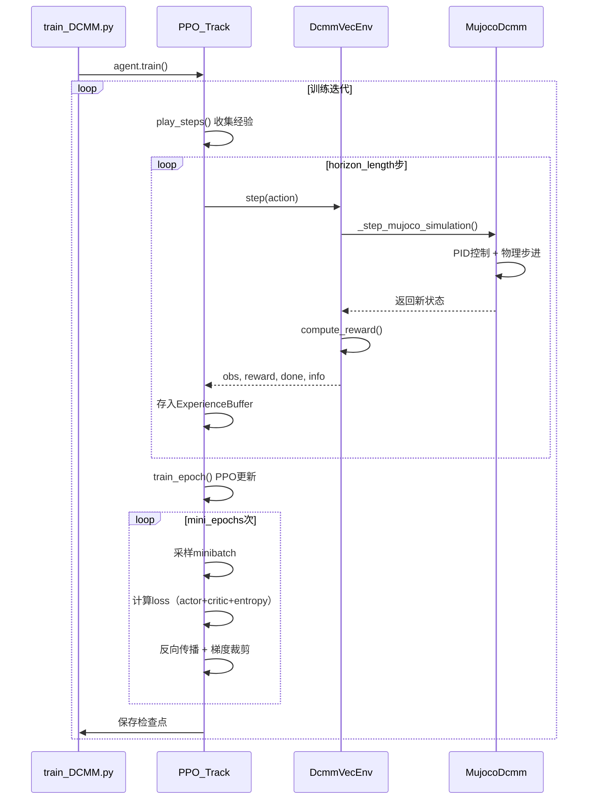

# Catch It 项目架构分析文档

> **文档目的**：为AI和开发者提供快速理解项目结构的核心参考，便于重构和优化。
> 
> **最后更新**：2025-11-27

---

## 📋 目录

- [项目概述](#项目概述)
- [核心架构](#核心架构)
- [关键文件详解](#关键文件详解)
- [数据流分析](#数据流分析)
- [两阶段训练机制](#两阶段训练机制)
- [重构建议](#重构建议)

---

## 🎯 项目概述

### 项目定位
基于强化学习的**两阶段移动抓取**系统，训练移动机械臂机器人在农业场景中进行目标追踪和抓取。

### 核心技术栈
- **仿真引擎**: MuJoCo (≥3.0.0)
- **RL算法**: PPO (Proximal Policy Optimization)
- **深度学习**: PyTorch
- **环境框架**: Gymnasium (0.29.1)
- **配置管理**: Hydra + OmegaConf
- **实验跟踪**: WandB + TensorboardX

### 应用场景
农业采摘机器人，需要：
1. **Stage 1 (Tracking)**: 控制移动底盘+机械臂接近目标果实（固定手部）
2. **Stage 2 (Catching)**: 冻结Stage 1策略，训练灵巧手抓取果实

---

## 🏗️ 核心架构

### 整体架构图



### 目录结构（核心文件）

```
catch_it/
├── train_DCMM.py                    # 【入口】训练/测试主脚本
├── configs/                          # 【配置】训练参数
│   ├── config.yaml                   # 总配置（任务、设备、WandB）
│   ├── train/DcmmPPO.yaml            # PPO超参数
│   └── env/DcmmCfg.py                # 环境配置（奖励权重、PID、物理参数）
├── gym_dcmm/                         # 【核心包】环境+算法
│   ├── envs/
│   │   └── DcmmVecEnv.py             # 【核心】Gym环境实现（1371行）
│   ├── agents/
│   │   └── MujocoDcmm.py             # MuJoCo仿真接口（375行）
│   ├── algs/ppo_dcmm/                # PPO算法实现
│   │   ├── ppo_dcmm_track.py         # Stage 1训练器
│   │   ├── ppo_dcmm_catch_two_stage.py # Stage 2训练器（两阶段）
│   │   ├── ppo_dcmm_catch_one_stage.py # Stage 2训练器（单阶段）
│   │   ├── models_track.py           # Stage 1网络（CNN+MLP）
│   │   ├── models_catch.py           # Stage 2网络（双MLP）
│   │   ├── experience.py             # 经验缓冲区
│   │   └── utils.py                  # 训练工具（归一化、指标）
│   └── utils/                        # 工具函数
│       ├── pid.py                    # PID控制器
│       ├── ik_pkg/                   # 逆运动学求解器
│       │   ├── ik_arm.py             # 机械臂IK
│       │   └── ik_base.py            # 移动底盘IK
│       ├── quat_utils.py             # 四元数工具
│       └── util.py                   # 通用工具
├── assets/                           # 资源文件
│   ├── urdf/                         # MuJoCo场景文件
│   │   ├── x1_xarm6_leap_right_object.xml      # 训练场景
│   │   ├── x1_xarm6_leap_right_unseen_object.xml # 测试场景
│   │   └── xarm6_right.xml           # 机械臂模型
│   ├── meshes/                       # 3D网格（机器人、植物）
│   ├── objects/                      # 目标物体模型
│   ├── models/                       # 训练好的模型权重
│   └── textures/                     # 纹理资源
├── outputs/                          # 训练输出
│   └── [实验名]/[时间戳]/
│       ├── checkpoints/              # 模型检查点
│       └── logs/                     # 日志
├── test_env.py                       # 环境测试脚本
├── verify_*.py                       # 验证脚本（sim2real、环境等）
└── visualize_env.py                  # 可视化工具
```

---

## 📂 关键文件详解

### 1. **train_DCMM.py** - 训练入口 (100行)

**作用**: 统一的训练/测试入口，负责环境创建、PPO实例化和训练流程控制。

**关键逻辑**:
```python
# 1. 根据任务类型选择PPO实现
PPO = PPO_Track if config.task == 'Tracking' else \
      PPO_Catch_TwoStage if config.task == 'Catching_TwoStage' else \
      PPO_Catch_OneStage

# 2. 创建向量化环境（支持多进程并行）
env = gym.make_vec(
    'gym_dcmm/DcmmVecWorld-v0',
    num_envs=config.num_envs,
    task='Tracking'/'Catching',
    camera_name=["top"],          # 车顶深度相机
    render_mode="depth_array"
)

# 3. 初始化PPO并训练
agent = PPO(env, output_dif, full_config)
agent.train()  # 或 agent.test()
```

**AI需要知道**:
- 通过 `config.task` 参数切换训练阶段
- 支持从检查点恢复训练（`checkpoint_tracking`/`checkpoint_catching`）
- 自动限制 `num_envs ≤ 16` 避免CPU过载

---

### 2. **DcmmVecEnv.py** - 环境核心 (1371行)

**作用**: 实现Gym环境接口，定义观测空间、动作空间、奖励函数和环境重置逻辑。

#### 观测空间 (Observation Space)
```python
# Stage 1 (Tracking): 15维向量 + 深度图
{
    "vector": [15],  # 机器人状态 + 目标相对位置
    "depth": [1, 224, 224]  # 车顶深度相机
}

# Stage 2 (Catching): 39维向量
{
    "obs": [39],     # 15 (Stage1) + 12 (手部关节) + 12 (手指位置)
    "obs_t": [27],   # 追踪部分观测（无手部）
    "obs_c": [37]    # 抓取部分观测（无底盘）
}
```

**15维向量详解**:
1. `ee_pos_rel` (3): 末端执行器相对目标的位置
2. `ee_quat_rel` (4): 末端执行器相对目标的姿态（四元数）
3. `ee_v_lin_rel` (3): 末端执行器相对速度
4. `obj_pos_rel` (3): 目标相对底盘的位置
5. `obj_v_lin_rel` (3): 目标相对速度（**Sim2Real中置零**）

#### 动作空间 (Action Space)
```python
# Stage 1: 8维
[
    base_vel (2),      # 底盘线速度 + 角速度
    ee_delta_pose (6)  # 末端执行器增量（位置3 + 欧拉角3）
]

# Stage 2: 20维
[
    base_vel (2),
    ee_delta_pose (6),
    hand_joints (12)   # 灵巧手16关节 → 12维（掩码处理）
]
```

#### 奖励函数 (Reward Function)

**Stage 1 核心奖励**:
```python
def compute_reward(self, obs, info, ctrl):
    # 1. 到达奖励 (线性，鼓励接近)
    r_reaching = max(0.0, 5.0 - info["ee_distance"])
    
    # 2. 基座接近奖励 (新增，帮助车辆移动)
    r_base_approach = max(0.0, 2.0 - info["base_distance"])
    
    # 3. 姿态对齐奖励 (触发条件: ee_distance < 2.0)
    r_orientation = max(0, alignment) * 2.0 if ee_distance < 2.0 else 0
    
    # 4. 接触奖励 (高奖励，鼓励温和接触)
    r_touch = 10.0 if has_contact else 0
    r_touch -= impact_penalty  # 惩罚高速碰撞
    
    # 5. 植物碰撞惩罚 (允许轻微接触叶子)
    r_plant_collision = -0.5 * num_plant_contacts
    
    # 6. 正则化惩罚 (抑制过大动作)
    r_regularization = -0.05 * ||ctrl||
    
    return w1*r_reaching + w2*r_base + w3*r_orient + 
           w4*r_touch + w5*r_plant + w6*r_reg
```

**终止条件**:
- **成功**: 持续接触目标10步
- **失败**: Episode超时 (env_time=4.0s)
- **无碰撞终止**: 允许植物碰撞继续训练

#### 域随机化 (Domain Randomization)

**Sim2Real关键参数** (在 `DcmmCfg.py`):
```python
# 观测噪声
k_obs_object = 0.025   # 目标位置噪声 ±2.5cm
k_obs_base = 0.01      # 底盘状态噪声
k_obs_arm = 0.001      # 机械臂关节噪声

# 动作延迟（模拟通信延迟）
act_delay = {
    'base': [1, 2, 3],  # 40-120ms (sim step = 40ms)
    'arm': [1, 2, 3],
    'hand': [1, 2, 3]
}

# 物理参数随机化
object_mass = [0.035, 0.075]      # kg
object_damping = [5e-3, 2e-2]     # 阻尼
k_drive = [0.75, 1.25]            # 驱动力矩随机
```

**场景随机化** (重要):
```python
def randomize_fruit_on_stem(self):
    """
    在8个植物茎干上随机附着果实
    - 仅在车辆前方60°视野内生成
    - 高度: 0.8-1.5m
    - 距离: 1.5-3.5m
    - 至少有1根植物遮挡果实（模拟真实遮挡）
    """
```

**AI需要知道**:
- **奖励权重全在 `DcmmCfg.py` 的 `reward_weights` 字典中定义**
- 环境使用 **PID控制器** 将速度指令转换为关节扭矩
- 深度图通过车顶相机生成，分辨率 224×224

---

### 3. **MujocoDcmm.py** - MuJoCo接口 (375行)

**作用**: 封装MuJoCo底层API，提供机器人控制、IK求解、相机处理接口。

**核心功能**:
```python
class MJ_DCMM:
    def move_base_vel(self, target_base_vel):
        """底盘速度控制（双阿克曼模型）"""
        # 使用PID控制器 + 运动学逆解
    
    def move_ee_pose(self, delta_pose):
        """末端执行器增量控制"""
        # IK求解 → 关节目标角度
    
    def action_hand2qpos(self, action_hand):
        """手部动作到关节位置映射"""
        # 应用掩码 + 关节限位
    
    def pixel_2_world(self, pixel_x, pixel_y, depth, camera):
        """像素坐标转世界坐标（用于视觉伺服）"""
    
    def depth_2_meters(self, depth):
        """深度值归一化（MuJoCo [0,1] → 真实米数）"""
```

**AI需要知道**:
- 使用 **QP求解器** 进行机械臂IK（配置在 `DcmmCfg.py` 的 `ik_config`）
- 移动底盘采用 **双阿克曼转向模型** (RangerMiniV2)
- 支持 **历史速度平滑**（`vel_history` deque）

---

### 4. **PPO训练器** - 算法实现

#### 4.1 **ppo_dcmm_track.py** (615行)

**Stage 1专用训练器**，特点：
- 支持 **图像+向量** 混合输入
- 使用 `models_track.py` 的 **CNN+MLP架构**
- 自适应学习率（KL散度触发）
- 经验回放缓冲区（`ExperienceBuffer`）

**关键超参数** (在 `DcmmPPO.yaml`):
```yaml
horizon_length: 64        # 每次收集64步经验
minibatch_size: 512       # Mini-batch大小
mini_epochs: 6            # 每批数据更新6轮
learning_rate: 5e-4       # 初始学习率
lr_schedule: kl           # KL散度自适应调整
action_track_denorm: [1.5, 0.025, 0.01]  # 动作反归一化
```

#### 4.2 **ppo_dcmm_catch_two_stage.py** (612行)

**Stage 2两阶段训练器**，关键机制：
```python
def load_tracking_model(self, checkpoint_tracking, checkpoint_catching):
    """
    加载Stage 1模型并冻结参数
    - 加载actor_mlp + mu权重
    - 设置requires_grad=False
    - 仅训练手部控制策略
    """
    self.actor_mlp_t.load_state_dict(...)
    for param in self.actor_mlp_t.parameters():
        param.requires_grad = False
```

**双MLP架构** (`models_catch.py`):
```python
class ActorCritic:
    actor_mlp_t  # 追踪部分（冻结）
    actor_mlp_c  # 抓取部分（训练）
    mu_t         # 底盘+手臂动作头（冻结）
    mu_c         # 手部动作头（训练）
```

**AI需要知道**:
- **必须先训练Stage 1，再训练Stage 2**
- Stage 2的观测空间包含手部关节和手指位置（39维）
- 动作空间扩展到20维（8维运动 + 12维手部）

---

### 5. **models_track.py** - Stage 1网络 (209行)

**网络结构**:
```
输入:
├─ Vector (15维)      → MLP (256→128)
└─ Depth Image (1×224×224) → CNN → 256维特征

合并 → Actor MLP → 动作分布 (8维)
     → Value MLP → 状态价值 (1维)
```

**CNN架构**:
```python
CNNBase:
    Conv2d(1, 32, 8, stride=4) → ReLU
    Conv2d(32, 64, 4, stride=2) → ReLU
    Conv2d(64, 32, 3, stride=1) → ReLU
    Flatten → Linear(_, 256)
```

**策略头**:
```python
mu = tanh(Linear(128, 8))       # 动作均值 ∈ [-1,1]
sigma = exp(learnable_param)     # 动作标准差
```

---

### 6. **DcmmCfg.py** - 环境配置 (156行)

**这是AI修改奖励/物理参数的唯一入口！**

**关键配置项**:
```python
# 奖励权重（修改这里调整训练目标）
reward_weights = {
    "r_ee_pos": 1.0,        # 到达奖励权重
    "r_base_pos": 0.0,      # 基座奖励（可启用）
    "r_orient": 1.0,        # 姿态对齐
    "r_touch": {
        'Tracking': 10,     # Stage 1接触奖励
        'Catching': 0.1
    },
    "r_collision": -10.0,   # 碰撞惩罚
    "r_regularization": 0.05
}

# PID参数（控制器调优）
Kp_arm = [300.0, 400.0, 400.0, 50.0, 200.0, 20.0]  # 6关节P增益
Kd_arm = [40.0, 40.0, 40.0, 5.0, 10.0, 1]         # D增益

# 域随机化
k_obs_object = 0.025    # Sim2Real关键参数
act_delay = [1, 2, 3]   # 动作延迟步数
```

---

## 🔄 数据流分析

### 完整训练循环



### 观测处理流程

```python
# 1. DcmmVecEnv._get_obs()
raw_obs = {
    "vector": np.array([15]),  # 原始状态
    "depth": np.array([1, 224, 224])
}

# 2. PPO_Track.obs2tensor()
obs_tensor = {
    "vector": torch.tensor(raw_obs["vector"]).to(device),
    "depth": torch.tensor(raw_obs["depth"]).to(device)
}

# 3. RunningMeanStd归一化
normalized_obs = running_mean_std.normalize(obs_tensor)

# 4. ActorCritic.forward()
action_dist, value = model(normalized_obs)
```

---

## 🎓 两阶段训练机制

### Stage 1: Tracking (追踪阶段)

**目标**: 训练底盘+机械臂导航到目标附近并保持接触

**训练命令**:
```bash
python train_DCMM.py task=Tracking
```

**输出**: 
- 模型保存路径: `outputs/Dcmm/[时间戳]/checkpoints/best_reward_*.pth`
- 包含: `actor_mlp`, `mu`, `sigma`, `value`, `optimizer` 状态

**成功指标**:
- `reward_mean` > 4.5
- `reward_touch` 比例 > 60%
- `episode_length` 增长到接近超时

---

### Stage 2: Catching (抓取阶段)

**前置条件**: 必须先完成Stage 1训练

**配置步骤**:
1. 修改 `configs/config.yaml`:
   ```yaml
   task: Catching_TwoStage
   checkpoint_tracking: 'outputs/.../best_reward_*.pth'
   ```

2. 运行训练:
   ```bash
   python train_DCMM.py task=Catching_TwoStage
   ```

**机制**:
- 加载Stage 1的 `actor_mlp_t` 和 `mu_t` 权重
- 冻结这两部分参数（`requires_grad=False`）
- 仅训练 `actor_mlp_c` (手部策略) 和 `mu_c`

**奖励函数**:
```python
# Stage 2额外奖励
r_precision = 10.0 * (1 - distance_to_center)  # 接近物体中心
r_stability = 20.0 * exp(-object_velocity)     # 抓取稳定性
r_finger_approach = 1.0 * sum(finger_distances) # 手指接近奖励
```

---

## 🔧 重构建议

### 1. **模块化改进**

#### 当前问题:
- `DcmmVecEnv.py` 过大（1371行），混合了环境逻辑、奖励计算、场景随机化
- 奖励函数硬编码在环境中，难以快速实验

#### 建议:
```
gym_dcmm/envs/
├── base_env.py           # 基础环境（观测、动作空间）
├── reward_functions/     # 奖励函数模块
│   ├── tracking_reward.py
│   └── catching_reward.py
├── randomization.py      # 域随机化逻辑
└── scene_manager.py      # 场景管理（植物、果实生成）
```

**修改示例**:
```python
# tracking_reward.py
class TrackingReward:
    def __init__(self, weights):
        self.weights = weights
    
    def compute(self, obs, info, ctrl):
        r_reaching = max(0.0, 5.0 - info["ee_distance"])
        r_touch = 10.0 if info["has_contact"] else 0
        # ...
        return self.weights["r_ee_pos"] * r_reaching + ...
```

---

### 2. **配置解耦**

#### 当前问题:
- 奖励权重、PID参数、物理参数全在 `DcmmCfg.py` 的全局变量中
- YAML配置和Python配置混用，缺乏统一性

#### 建议:
将 `DcmmCfg.py` 迁移到YAML:
```yaml
# configs/env/tracking.yaml
reward:
  r_ee_pos: 1.0
  r_touch: 10.0
  plant_collision: -0.5

physics:
  object_mass: [0.035, 0.075]
  k_obs_object: 0.025
  act_delay: [1, 2, 3]

pid:
  Kp_arm: [300.0, 400.0, 400.0, 50.0, 200.0, 20.0]
  Kd_arm: [40.0, 40.0, 40.0, 5.0, 10.0, 1]
```

---

### 3. **训练器抽象**

#### 当前问题:
- `PPO_Track`, `PPO_Catch_TwoStage`, `PPO_Catch_OneStage` 代码重复度高
- 公共逻辑（经验收集、梯度更新）未抽取

#### 建议:
```python
# gym_dcmm/algs/base_ppo.py
class BasePPO:
    def train_epoch(self):
        """通用PPO更新逻辑"""
    
    def play_steps(self):
        """通用经验收集"""
    
    def obs2tensor(self, obs):
        """子类实现"""
        raise NotImplementedError

# 子类仅实现差异部分
class PPO_Track(BasePPO):
    def obs2tensor(self, obs):
        # Stage 1特有的观测处理
        pass
```

---

### 4. **奖励调试工具**

**建议添加**:
```python
# tools/reward_analyzer.py
def analyze_reward_distribution(checkpoint_path):
    """
    加载检查点，运行100个episode
    统计各奖励项的分布、相关性
    生成报告：
    - 哪些奖励项从未触发？
    - 哪些奖励项主导总奖励？
    - 动作分布是否合理？
    """
```

---

### 5. **代码复用性**

#### 建议改进点:

**机器人模型更换**:
```python
# configs/robot/xarm6_leap.yaml
robot_model: "x1_xarm6_leap_right"
arm_joints: 6
hand_joints: 16
xml_path: "urdf/x1_xarm6_leap_right_object.xml"

# 支持快速切换到其他机器人
# configs/robot/franka_allegro.yaml
robot_model: "franka_allegro"
arm_joints: 7
hand_joints: 16
xml_path: "urdf/franka_allegro_object.xml"
```

**环境注册**:
```python
# gym_dcmm/__init__.py
register(
    id='DcmmTracking-v0',
    entry_point='gym_dcmm.envs:DcmmVecEnv',
    kwargs={'task': 'tracking'}
)
```

---

## 📊 关键指标对照表

### 训练进度判断

| 指标 | 初始值 | 良好 | 优秀 | 说明 |
|------|--------|------|------|------|
| `reward_mean` | ~0.5 | >3.0 | >4.5 | 平均总奖励 |
| `reward_reaching` | ~1.0 | >2.5 | >3.5 | 到达奖励 |
| `reward_touch` | ~0 | >1.0 | >2.0 | 接触成功率指标 |
| `episode_length` | ~50 | >80 | >95 | 接近超时=持续接触成功 |
| `plant_collision` | <-2.0 | >-1.0 | >-0.5 | 避障能力 |
| FPS | >500 | >800 | >1000 | 训练效率 |

### 超参数敏感度

| 参数 | 默认值 | 影响 | 调整建议 |
|------|--------|------|----------|
| `learning_rate` | 5e-4 | 收敛速度 | KL散度>0.02时降低 |
| `r_touch` | 10.0 | 接触行为 | 过低导致不愿接触 |
| `r_collision` | -10.0 | 避障激进度 | 过高导致过度避障 |
| `horizon_length` | 64 | 样本质量 | 越大越稳定但慢 |
| `mini_epochs` | 6 | 更新强度 | 配合KL阈值调整 |

---

## 🚀 快速定位指南

### 想修改奖励函数？
→ **文件**: `gym_dcmm/envs/DcmmVecEnv.py` 的 `compute_reward()` 方法（L964-L1071）  
→ **权重**: `configs/env/DcmmCfg.py` 的 `reward_weights` 字典（L33-L53）

### 想调整观测空间？
→ **文件**: `gym_dcmm/envs/DcmmVecEnv.py` 的 `_get_obs()` 方法（L462-L534）  
→ **注意**: 修改后需同步更新网络输入维度

### 想更换机器人模型？
→ **URDF**: `assets/urdf/*.xml`  
→ **配置**: `configs/env/DcmmCfg.py` 的 `arm_joints`, `hand_joints`  
→ **影响**: 需修改动作空间维度

### 想优化训练速度？
→ **并行数**: `configs/config.yaml` 的 `num_envs` (建议=CPU核心数)  
→ **Batch大小**: `configs/train/DcmmPPO.yaml` 的 `minibatch_size`  
→ **仿真频率**: `train_DCMM.py` 的 `steps_per_policy=20`

### 想启用Sim2Real？
→ **噪声**: `configs/env/DcmmCfg.py` 的 `k_obs_*` 参数  
→ **延迟**: `act_delay` 字典  
→ **速度置零**: `DcmmVecEnv.py` 中 `obj_v_lin_rel` 强制设为0

---

## 📝 总结

### 核心文件优先级（AI必看）

1. ⭐⭐⭐ **DcmmVecEnv.py** - 环境核心，奖励函数在此
2. ⭐⭐⭐ **DcmmCfg.py** - 所有可调参数的入口
3. ⭐⭐ **ppo_dcmm_track.py** - Stage 1训练逻辑
4. ⭐⭐ **models_track.py** - 网络结构定义
5. ⭐ **config.yaml** + **DcmmPPO.yaml** - 训练超参数

### 重构优先级

1. **高**: 奖励函数模块化（便于实验）
2. **高**: 配置统一到YAML（减少硬编码）
3. **中**: 训练器代码复用（减少维护成本）
4. **中**: 机器人模型解耦（提升扩展性）
5. **低**: 添加调试工具（提升开发效率）

---

**文档维护**: 如有架构变更，请及时更新本文档对应章节。
